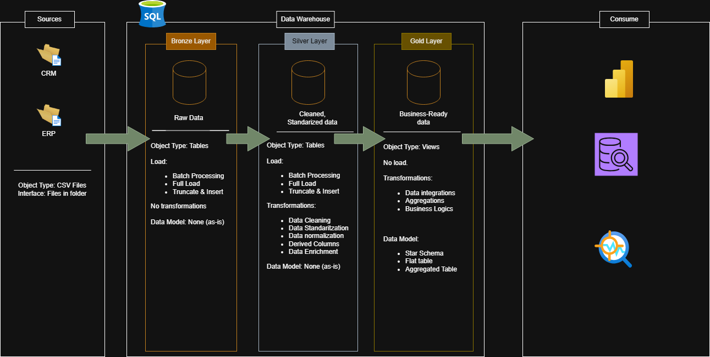
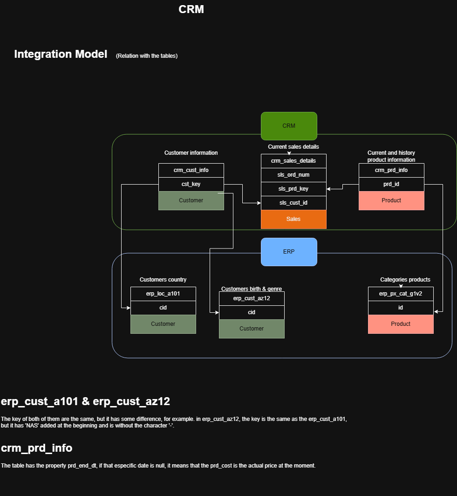
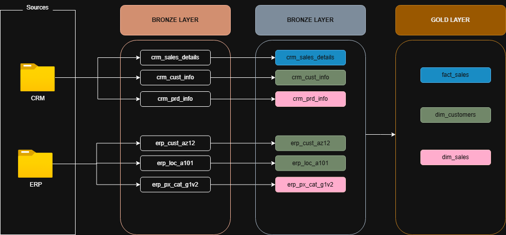
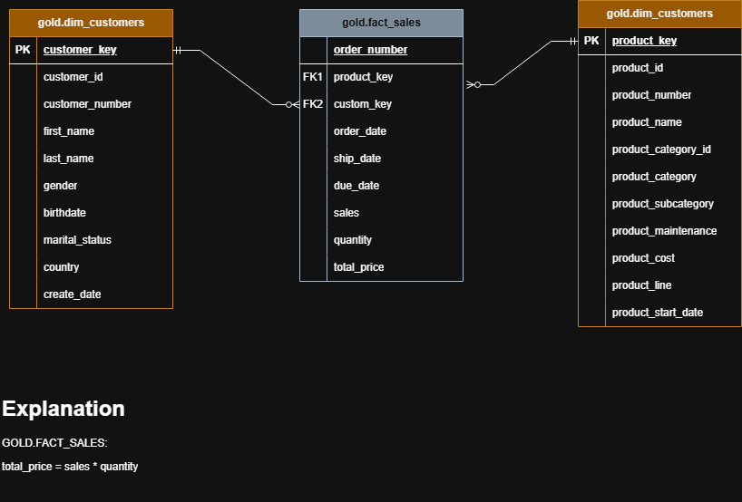

# SQL-DATAWAREHOUSE PROJECT

This is a project focused on understanding the process of the data in a Data Warehouse. Next I'll describre the tables, and the schemes.

## Project structure

```
sql-datawarehouse/
├── datasets/
│   ├── crm/
│   │   ├── cust_info.csv
│   │   ├── prd_info.csv
│   │   └── sales_details.csv
│   └── erp/
│       ├── CUST_AZ12.csv
│       ├── LOC_A101.csv
│       └── PX_CAT_G1V2.csv
├── docs/
├── img/
│   ├── Data_Flow.drawio.png
│   ├── Diagrama_Datawarehouse.drawio.png
│   ├── Integration_Model.drawio.png
│   └── Star_Schema.drawio.png
├── SQL code/
│   ├── FactsCreation/
│   │   └── FactSales.sql
│   ├── InsertingData/
│   │   ├── InsertingDataSilverCrmCustInfo.sql
│   │   ├── InsertingDataSilverCrmPrdInfo.sql
│   │   ├── InsertingDataSilverCrmSalesDetails.sql
│   │   ├── InsertingDataSilverErpCustAz12.sql
│   │   ├── InsertingDataSilverErpLocA101.sql
│   │   └── InsertingDataSilverErpPxCatG1V2.sql
│   ├── ViewsCreation/
│   │   ├── View Dimension Customer.sql
│   │   └── View Dimension Products.sql
│   ├── BronzeLayerCreation.sql
│   ├── InsertingDataBronze.sql
│   ├── InsertingDataSilver.sql
│   └── SilverLayerCreation.sql
└── README.md
```

## Schema 

This is the process of the Data Warehouse I'll build. 
- <ins>Sources</ins>:
The sources are downloaded and the type of archive is csv (In draw.io is doc). The archivese are located in the folder 'datasets' in it's own folder, for example, I have 2, 'crm' and 'erp'
in total there are 6 csv.
- <ins>Bronze layer</ins>:
In this step I will only insert the data in my database, and as the image describes, I won't do any cleaning or transformation now.
- <ins>Silver layer</ins>:
Here I will do clean the data and transform it, changing the nulls, adapting and adding new columns or even deleting columns. 
- <ins>Gold layer</ins>:
After doing al the cleansing and transformation, now I'll create the views, the dimensions and the facts.
- <ins>Consume</ins>:
Finishing all the layers, now the data is ready to consume in a star schema. We can do reports in Power BI for example, but that will be done in a nother project. 
I'll put the link to that project here:



## Table relations

I have multiple tables, now I'll show how it connects between each other:



## Data flow
Also, this will be the data flow of the project:



## Result
Finished the project, this is the fact and the dimensions.As we can see, this is a star scheme as a mentioned before:




## Note
This is a tutorial project, were I reinforced all the knowledge I have. The author of this project is <ins>Data with Baraa</ins>. I didn't just copied everything, I understood everything and did the code before he shows it in the tutorial.